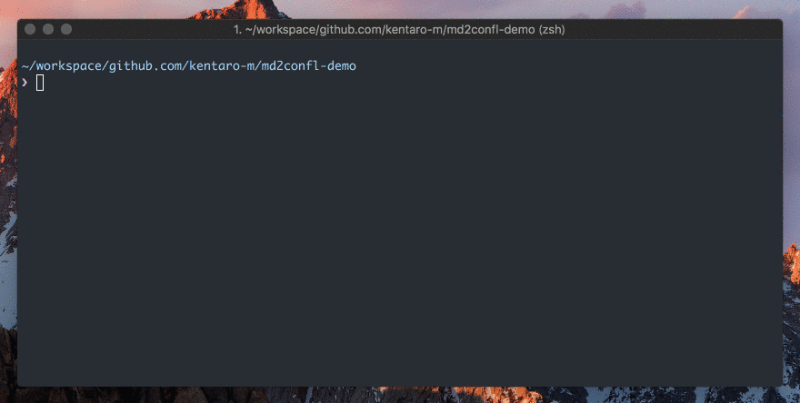

# md2confl
[](https://circleci.com/gh/kentaro-m/md2confl/tree/master)
[](https://github.com/kentaro-m/md2confl/releases)
[](https://github.com/kentaro-m/md2confl/blob/master/LICENSE)

md2confl is a CLI tool to convert the markdown text to confluence wiki format.

## Demo


## Installation

### Homebrew
```
$ brew tap kentaro-m/homebrew-md2confl
$ brew install md2confl
```

### Golang
```
$ GO111MODULE=on go get github.com/kentaro-m/md2confl
```

## Usage
```
Output the confluence wiki text

Usage:
  md2confl [file path] [flags]

Flags:
  -h, --help      Output usage information
  -v, --version   Output the version number
```

## Example

### Output to the stdout
```
$ md2confl ~/sample.md
h1. Hello World

{code:language=go}
package main

import "fmt"

func main() {
	fmt.Println("Hello World")
}
{code}
```

### Output to the file
```
$ md2confl ~/sample.md > foo.txt
```

### Copy to clipboard
```
$ md2confl ~/sample.md | pbcopy
```

### Input from stdin
```
$ cat hoge.txt | md2confl
```

## License
MIT
